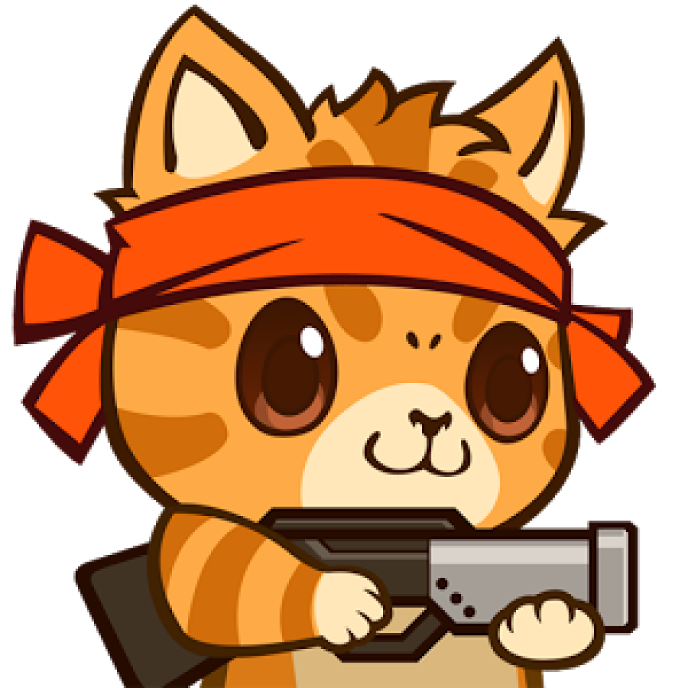

# Javascript-Capstone Project: Build a Shooter Game

## Table of Contents

* [About the Project](#about-the-project)
* [The Game](#the-game)
  * [How to play](#how-to-play)
 * [Characters](#characters)
 * [Scenes](#scenes)
* [Tecnologies used](#tecnologies-used)
* [Author](#author)
* [Show your Support](#show-your-support)
* [Acknowledgements](#acknowledgements)

<!-- ABOUT THE PROJECT -->
## About The Project

<!-- THE GAME -->
## The game

<!-- HOW TO PLAY -->
### How to Play

<!-- CHARACTERS -->
### Characters

* Player: 

Benito the Cat: He can move at 4 directions, and use the space bar to shoot his enemies. Like all cats, he has 7 lives.

* Enemy 1 : 

Angry Dog: it will appear randomly shooting lasers. You receive +15 every time you make it explode.

* Enemy 2:  

Snake:  it will appear at a random velocity and location shooting lasers. You will receive +10 points every time you shoot one successfully

* Enemy 3: 

Human Chaser: He will chase you through all the game. You will receive +25 points every time you destroy one.

<!-- SCENES -->
### Scenes

* Menu 

* About

* High Scores

* Main 

* Game Over

<!-- TECNOLOGIES USED -->
## Tecnologies used

*   HTML5
*   Phaser 3
*   SCSS
*   Webpack
*   Javascript
*   Eslint
*   Babel
*   Jest for testing
*   [Netlify](https://www.netlify.com/) for deployment
*   [Leaderboard API service](https://www.notion.so/Leaderboard-API-service-24c0c3c116974ac49488d4eb0267ade3) for high scores

<!--AUTHOR -->
## Author

  Melissa Castorena 
- Github: [@mcastorena0316](https://github.com/mcastorena0316)
- Linkedin: [Melissa Castorena](https://www.linkedin.com/in/melissa-castorena/) 

<!-- SHOW YOUR SUPPORT -->
## Show your Support

Give a star if you like this project!

<!-- ACKNOWLEDGEMENTS -->
## Acknowledgements

-Assets by: 
  [Justin Dalessandro(ColdOneK)](https://opengameart.org/users/coldonek)
  [Karin Jane](https://www.artstation.com/jkshade)
  [Flaming Text](https://flamingtext.com/)
  [Kenney.nl](www.kenney.nl)
  [Cleyton Kauffman](https://soundcloud.com/cleytonkauffma)
  [Mobeyee](mobeyee.com)

