# Javascript-Capstone Project: Build a Shooter Game

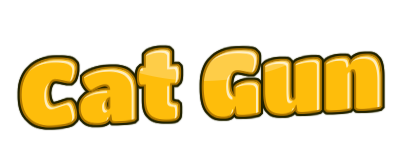

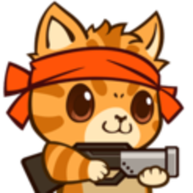

## Table of Contents

* [About the Project](#about-the-project)
* [The Game](#the-game)
  * [Inspiration](#inspiration)
  * [How to Play](#how-to-play)
  * [Installation](#installation)
  * [Characters](#characters)
  * [Scenes](#scenes)
* [Technologies used](#technologies-used)
* [Author](#author)
* [Show your Support](#show-your-support)
* [Acknowledgments](#acknowledgments)

<!-- ABOUT THE PROJECT -->
## About The Project

The objective of this project was to design and build a platform game like the one in [Space Shooter Game](https://learn.yorkcs.com/category/tutorials/gamedev/phaser-3/build-a-space-shooter-with-phaser-3/) using Phaser and Javascript among other technologies.

Live version of the project: [Live version](https://cat-gun.netlify.app/)

Project Link: [Javascript-Capstone](https://github.com/mcastorena0316/Javascript-Capstone)

<!-- THE GAME -->
## The game

In this never-ending game, you will face 3 different enemies at random times, and you have to use your laser to make them explode. Every enemy gives you a different score, and you need to avoid getting hit by their lasers or overlap with one of them. Every moment one of these events occurs, you will lose one life. 

You have 7 lives, after this, you will lose, and be redirected to a Game Over screen where you can submit your name and check for the highest scores.  

<!-- INSPIRATION -->
### Inspiration

This game is inspired in my cat "Benito" and the villains include one of his worst enemies: dogs, snakes (and reptiles in general), and the representation of my husband who is always trying to hug him (which he doesn't like at all).

<!-- HOW TO PLAY -->
### How to Play

You can move around the screen using the arrow keys 

 for moving around and use the Space Bar 

 to shoot whenever you see a bad guy.

<!-- INSTALLATION -->
### Installation

You can always use the [live version](https://cat-gun.netlify.app/) to play right away or install it locally using these steps:

#### Clone my repository

`$ https://github.com/mcastorena0316/Javascript-Capstone`

#### Go to my project's folder

`$ cd Javascript-Capstone`

#### Get the dependencies needed for the game

`$ npm install`

#### Start the server and the fun
`$ npm run dev`

<!-- CHARACTERS -->
### Characters

* Player: 
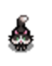

Benito the Cat: He can move at 4 directions, and use the space bar to shoot his enemies. Like all cats, he has 7 lives.

* Enemy 1 : 
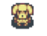

Angry Dog: it will appear randomly shooting lasers. You receive +15 every time you make it explode.

* Enemy 2:  
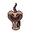

Snake:  it will appear at a random velocity and location shooting lasers. You will receive +10 points every time you shoot one successfully

* Enemy 3: 
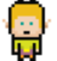

Human Chaser: He will chase you through all the game. You will receive +25 points every time you destroy one.

<!-- SCENES -->
### Scenes

* Menu 

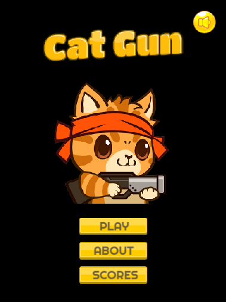

* About

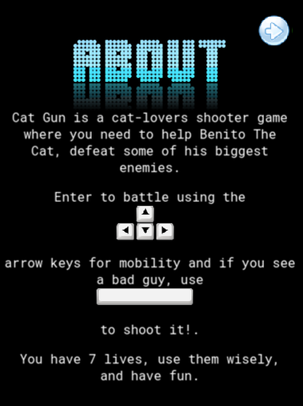

* High Scores

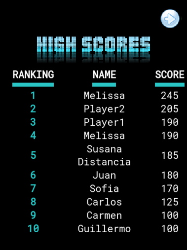

* Main 

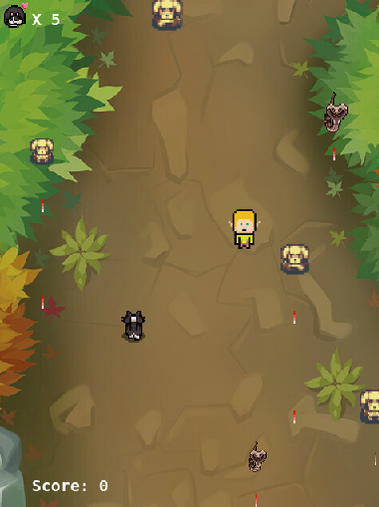

* Game Over

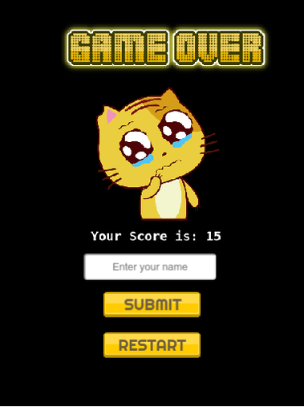

<!-- TECNOLOGIES USED -->
## Technologies used

*   HTML5
*   Phaser 3
*   SCSS
*   Webpack
*   Javascript
*   Eslint
*   Babel
*   Jest for testing
*   [Netlify](https://www.netlify.com/) for deployment
*   [Leaderboard API service](https://www.notion.so/Leaderboard-API-service-24c0c3c116974ac49488d4eb0267ade3) for high scores

<!--AUTHOR -->
## Author

  Melissa Castorena 
- Github: [@mcastorena0316](https://github.com/mcastorena0316)
- Linkedin: [Melissa Castorena](https://www.linkedin.com/in/melissa-castorena/) 

<!-- SHOW YOUR SUPPORT -->
## Show your Support

Give a star if you like this project!

<!-- ACKNOWLEDGEMENTS -->
## Acknowledgments

* [Microverse](https://www.microverse.org/)
* [Phaser](https://phaser.io/)
* [OpenGameArt](https://opengameart.org/)

- Assets by: 
  * [Justin Dalessandro(ColdOneK)](https://opengameart.org/users/coldonek)
  * [Karin Jane](https://www.artstation.com/jkshade)
  * [Flaming Text](https://flamingtext.com/)
  * [Kenney.nl](www.kenney.nl)
  * [Cleyton Kauffman](https://soundcloud.com/cleytonkauffma)
  * [Mobeyee](mobeyee.com)

